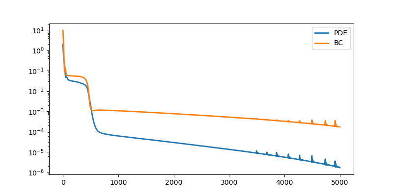
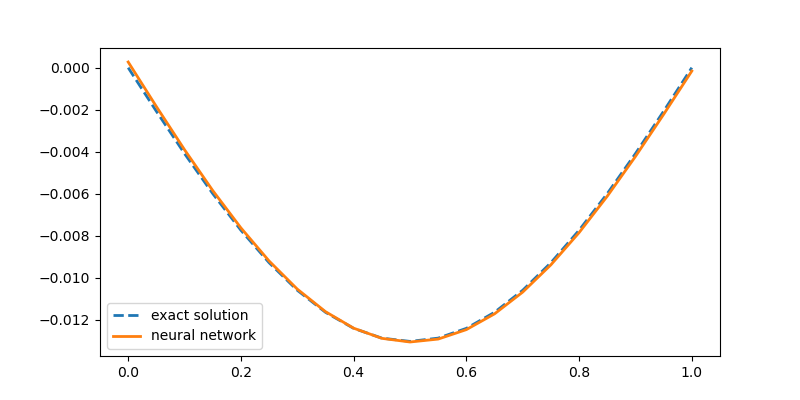

# Physics informed neural network for approximating the deformed shape of a beam   

We consider a beam on two supports and with a distributed load.  

We approximate the numerical soltuion of the differential equation of the beam with a neural network.   
We use the Jax library for machine learning.   

Evolution of loss function components during training of the PINN:   

Comparison of the numerical approximation obtained with the PINN, and the analytical solution of the beam deflection:   

